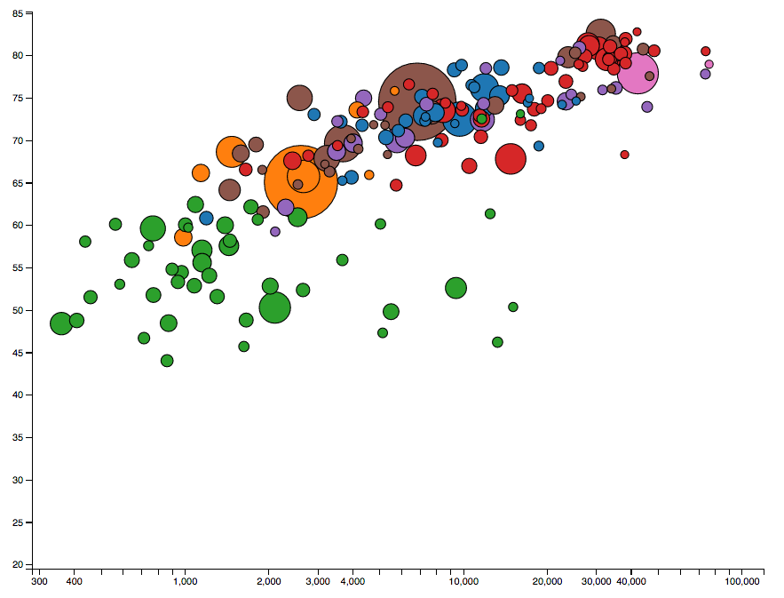

# GapMinder Visualization Exercise

Using d3.js, build a scatterplot of countries. This scatterplot should:

1. Size each circle according to the `population` size of this country.
2. Color each circle according to the region that country is in.
3. Position each circle on the x axis according to the country's `income`.
4. Position each circle on the y axis according to the country's `life_expectancy`.

You can use the year 2008 to start.

When you've completed the initial rendering, wire up your scatterplot to the
year selector dropdown so that a year change triggers a transition of the circles.
They should:
1. Reposition to the correct location
2. Resize according to the new value
3. Possibly disappear if that country/indicator doesn't have a value for the new
chosen year. Note that new circles may need to appear as well if coming from a
year that didn't have a value.

Notes:

* There are some helper methods in the `helpers.js` file that may be of use.
* Note, the data isn't perfect. There aren't always values available for all
indicators for all countries. Make sure to filter those out where you can.

For extra credit you can do any of the following:

1. Add X and Y axes
2. Add mouse interactions of any sort.
3. Add labels to the circles for the respective countries

## Installing

1. You can run `npm install`

## Running

1. If you run `npm run server` from your browser you can then open two
separate windows:

(http://localhost:8080)[http://localhost:8080] - for your local server
(http://localhost:8080/test/index.html)[http://localhost:8080/test/index.html] - to see the tests.

## Example Output

You can see the example output in `example-output.png`:

